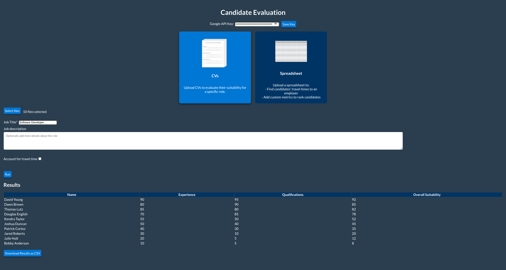

# Candidate Evaluation Software

## Overview

Open source desktop software to evaluate job candidates. Evaluates up to 2,000 CVs and 40,000 candidate-employer distances per day for free.

Preview:
  

### What It Does
#### Evaluate CVs:
- Analyses the content of a batch of CVs in any file format
- Optionally calculate candidates' travel time to the employer address

#### Evaluate Spreadheets:
- Rank candidates based on custom metrics
- Optionally calculate travel time

### Inspiration
#### The Job Market in 2025
At the time of writing, the number of job vacancies in the UK has fallen every quarter for the last 10 years. Fewer jobs has increased the demand for those vacancies. On top of that, recent years have seen the rise of AI software which people can use to automatically mass-apply.

As a result, even small companies can be inundated with job applications, leading to some closing vacancies early or selecting for interview based on the first x number of applicants or a random sample. This software aims to create better outcomes for employers and job seekers under these circumstances.

This software uses an LLM in Google Gemini. AI should never be 100% responsible for selecting candidates to interview - computers will never be able to use text to make better hiring decisions than an actual human who actually knows the role - but it may already be necessary to help narrow down when applicant numbers reach hundreds or thousands.
#### Working in Recruitment
I had recruitment responsibilities in a previous role with a candidate pool in the thousands. The company used a basic CRM system acting as recruitment software which offered little to no help in narrowing down suitable candidates for vacancies. This software is not a comprehensive recruitment solution either, but it would have been very useful and saved a lot of time back then.

Finding travel times to an employer would have been particularly useful as my colleagues and I spent lots of time manually typing post codes into Google Maps. Doing repetitive manual tasks that I knew could be automated inspired me to learn to code like nothing else.

## How it Works
### CVs:
CVs can be uploaded in pretty much any file format - PDFs, Word and ODF documents, even images.

CVs are split into batches of 10 and the content is converted to text. Each batch is sent through a Gemini request and the results are aggregated. Batches of 10 was the sweet spot to maximise use of Gemini's free allowance without compromising the accuracy of the responses.

Travel time can also be calculated for CVs with location info.

### Spreadsheets
Users can input custom metrics and their preferred weighting in the Overall Suitability calculation. This is aggregated using Pandas.

Travel times for candidates can also be calculated.

### Cloud Pricing and Free Allowances

For most use cases, this software is free to run. However, it is important to understand that you are liable to incur costs once you enter an API key.

CV evaluations use Google Gemini 2.0 Flash, which is free for 200 requests per day which can equate to up to 2000 CVs per day.

Candidate-employer travel time are queried use Google Maps Distance Matrix, which is free for 40,000 calculations per day.

### Stack

#### Frontend:
- `React.js` for user interface
- `Electron.js` to package the UI as desktop software

#### Backend:
- `Python` backend, uses `asyncio` for external API calls and `pandas` to organise responses
- `FastAPI` bundles the Python backend and exposes to the frontend

### Structure
- `api/`: FastAPI backend entry point
- `data/`: Directory for storing input/output files (e.g. test CVs)
- `frontend/`: React frontend and Electron app
  - `react-app/`: React code
  - `main.js`: Electron main process
- `requirements.txt`: Python dependencies for the backend
- `src/`: Python backend code
  - `evaluate_cvs.py`: CV evaluation logic
  - `evaluate_tables.py`: Spreadsheet evaluation logic
  - `utils/`: Helper functions (file conversion, GCP APIs)
<!-- - `test/`: Unit tests for the backend -->


## Installation Instructions

### Windows
[Download Here](https://github.com/tombracey/Candidate-Evaluation-Software/releases/tag/Windows-v1.0.0)
1. Extract All from the downloaded zip file ('CandidateEvaluation-win32-x64.zip')
2. Open the extracted folder.
3. Double-click CandidateEvaluation.exe to launch.

### Linux
[Download Here](https://github.com/tombracey/Candidate-Evaluation-Software/releases/tag/Linux-v1.0.0)
1. Extract the archive:
   tar -xvzf CandidateEvaluation-linux-x64.tar.gz
2. Navigate to the extracted directory:
   cd CandidateEvaluation-linux-x64
3. Run the app:
   ./CandidateEvaluation
4. If you encounter a sandbox error, run:
   sudo chown root ./chrome-sandbox
   sudo chmod 4755 ./chrome-sandbox

### Obtaining an API Key
1. Go to the [Google Cloud Console](https://console.cloud.google.com/). Set up an account if necessary.
2. Create a new project or select an existing one.
3. Enable Gemini and the Maps Distance Matrix APIs for your project.
4. Go to the Credentials section and create an API key.

- Please [let me know](mailto:tombracey22@gmail.com) if you experience any issues.
- Mac dist coming soon.

## Contributing Info

### Install Dependencies
Install backend dependencies:
```
python -m venv venv
source venv/bin/activate
pip install -r requirements.txt
```

Install frontend dependencies:
```
cd frontend
npm install
```

### Run in Development Environment
Run backend:
```
source venv/bin/activate
uvicorn api.main:app --reload
```

Start frontend:
(separate terminal)
```
cd frontend
npm start
```

### Build Instructions
#### Backend:
```bash
pyinstaller --onefile --name backend \
    --add-data "src:src" \
    --add-data "api:api" \
    --add-data "data:data" \
    --add-data "$(python -m site --user-site)/odfdo-<version>.dist-info:odfdo-<version>.dist-info" \
    backend/api/main.py
```

(replace the version with the odfdo version installed on your system)

Find version:
```
ls $(python -m site --user-site)/odfdo-*.dist-info
```
    
#### Frontend:
```
cd frontend/react-app
npm run build
```

Package:
```
npx electron-packager . CandidateEvaluation \
    --platform=linux --arch=x64 --out=dist --overwrite
```

### Git Contributions
1. Fork the repo.
2. Create a new branch:
    ```
    git checkout -b (branch name)
    ```
3. Commit changes and push to the new branch:
    ```
    git commit -m "(commit message)"
    git push origin (branch name)
    ```
4. Open a pull request.

### License
This project is licenced under the MIT License. See the [LICENSE](./LICENSE) file for details.